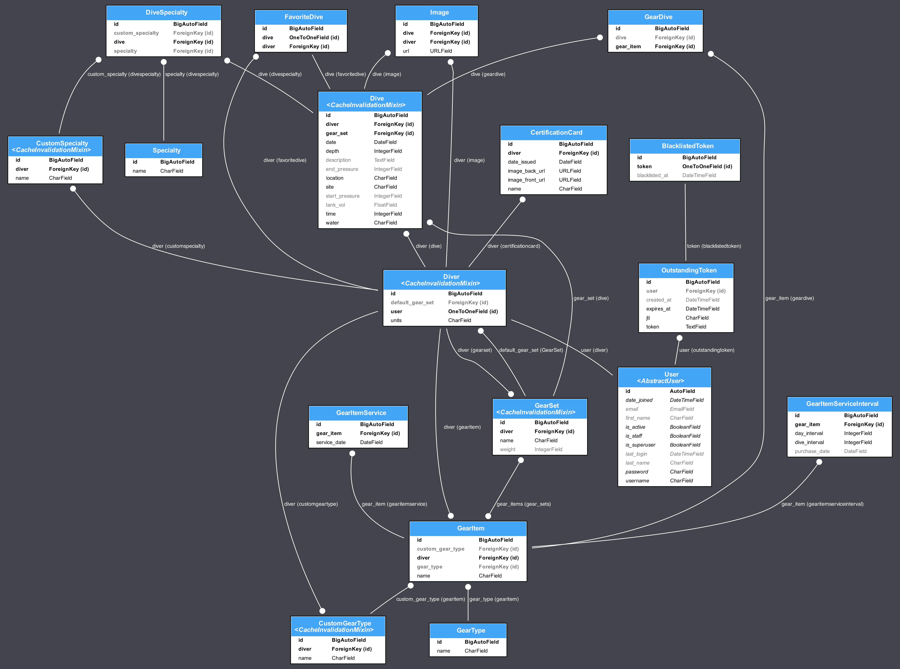

# Surface Interval

Surface Interval is designed as a scuba diver's companion app and solves the problem of gear and credential management for dive trips, dive planning, logging dives and uploading photos. This project is a Django-based REST API for managing scuba diving-related data. It provides endpoints for user login and for managing divers, dives, certifications, gear, and related assets.

| Endpoint | Description |
|--|--|
| cert-cards/ | CRUD diver certification cards |
| custom-gear-types/ | CRUD user-defined gear type categories |
| dives/ | Log and view dive entries |
| gear-items/ | CRUD individual gear items |
| gear-sets/ | CRUD diver gear sets containing gear items |
| gear-types/ | READ predefined gear categories |
| images/ | CRUD Upload and manage dive images |
| specialties/ | READ Manage pre-defined dive specialties |

 ### 💡 With project running, view the full API spec here: http://0.0.0.0:8000/api/docs/
 ⚙️ Full API schema is auto-generated using drf-spectacular.


# Developer Statement
I originally built Surface Interval as my frontend capstone project at Nashville Software School. It was built in React with a simple JSON server. SCUBA is a passion of mine and I wanted to recreate the project full-stack, use it to learn new things and demonstrate my skills. My personal goals for this project are the following:

1. Recreate project using Django backend and TypeScript frontend ✅
2. Learn TypeScript (continuous) ♾️
3. Implement Token Authorization ✅
4. Containerize project to simplify running it ✅
5. Rewrite the Dive Planner logic in a more mature way, using nested matrices compared to the epic if/else if blocks as a newbie dev. ✅
    1. New logic: https://github.com/DArmstrong87/surface-interval-ui/tree/master/src/components/dive_planner
    2. Old logic: https://github.com/DArmstrong87/surface-interval/tree/main/src/components/divePlanner
6. Support user-selected units (imperial vs metric) ✅
7. Generate a swagger doc ✅
8. Continuous Integration: Workflow with linting, formatting and unit tests ✅
9. Continuous Deployment: Deploy project (TBD) ⏳
10. Custom Diver properties to calculate dive data ✅
11. Complete functional UI ✅
12. Apply styling to UI ✅
13. Write some tests using mocked data ⏳
14. Custom ratelimit decorator ⏳
15. Caching ⏳

# Entity Relationship Diagram
Generated using django-extensions' `graph_models` command. A custom command `bin/erd` modifies the `erd.dot` file to customize the png output.




# LOCAL DEVELOPMENT

## 🛠️ Set Up Project

#### 1. Clone the repo
```
git clone https://github.com/DArmstrong87/surface-interval-server.git
cd surface-interval-server
```

#### 2. Create and activate virtual environment
```
python3 -m venv env
source env/bin/activate
```

#### 3. Install requirements
```
pip install -r requirements.txt
```

#### 4. Add .env
```
touch .env
```

```
DEBUG=True
DB_HOST=surface-interval-db
DB_PORT=5432
POSTGRES_DB=surface-interval-db
POSTGRES_USER=surfaceinterval
POSTGRES_PASSWORD=123
```

#### 5. Setup and seed database

#### Containerized (recommended) 📦
1. Ensure docker is installed: https://docs.docker.com/engine/install/
2. Run `bin/build` which will run the docker build command. This will also run django migrations and run django server.
    1. From here on, any python commands will need to be prepended with `docker-compose exec surface-interval-server`.
    2. Alternatively, you can stop the `surface-interval-server` container and run the server from the terminal, but you'll need to change your db host to `127.0.0.1` in your .env.
3. Run `docker-compose exec surface-interval-server bin/dbseed` which will install fixtures and seed the database.

That's it! 

#### Non-containerized ⌨️
1. #### Install postgres
- Install postgres using ubuntu:
    ```
    sudo sh -c 'echo "deb https://apt.postgresql.org/pub/repos/apt $(lsb_release -cs)-pgdg main" > /etc/apt/sources.list.d/pgdg.list'
    wget --quiet -O - https://www.postgresql.org/media/keys/ACCC4CF8.asc | sudo apt-key add -
    sudo apt-get update
    sudo apt-get -y install postgresql
    ```
- Install PostgreSQL development libraries:
`sudo apt-get install libpq-dev`
- Install PostgreSQL adapter for Python
`pip install psycopg2`

2. #### Run postgresql service
- `sudo service postgresql start`

3. #### Create db
- `sudo -u postgres psql`

4. #### Create USER
    ```
    CREATE USER surfaceinterval WITH PASSWORD 'yourpassword';
    GRANT ALL PRIVILEGES ON DATABASE surface-interval-db TO surfaceinterval;
    ```

5. #### Create DB
- `createdb surface-interval-db`

6. #### Run migrations
- `python manage.py migrate`


## ▶️ USING THE API

#### Connect to local db

<b>Docker:</b> As long as container is running, you are good to go!

<b>Non-Docker:</b> Run `bin/pgconnect` -- This automatically enters your user password as stored in the .env file to connect.

⚠️ Endpoints require a token. The token is tied to a user and is provided by logging in, registering or running the `drf_create_token` command.

#### Register New User 🪪
As long as you ran the `bin/dbseed` command, you should not have to do this but for registering a new user and testing the `/register` endpoint, provide the following:
```
username
email
password
first_name
last_name
units (provide 'metric' or 'imperial')
```

#### Login and Tokens
Access the /login endpoint and provide the following:
```
username
password
```

#### Generate Token 🪙

```
curl \
  -X POST \
  -H "Content-Type: application/json" \
  -d '{"username": "TestUser@surfaceinterval.app", "password": "123"}' \
  http://localhost:8000/api/token/
```

### API Authorization Header 🔒
Provide the token in the header as `Authorization: Bearer "<TOKEN>"`

### Generate API spec
```
python3 manage.py spectacular --file schema.yaml
```
View this spec at /api/docs
